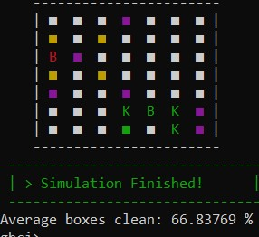

# agents-sim

Simulation of agents project for Simulation and Declarative Programming courses

Para ejecutar el proyecto lo recomendable es entrar en una session interactiva en el `GHCI`, indicando la flag `-package split`, esto debe hacerse en la raiz de `src/`:

```
ghci -package split
```

Luego cargar el `main.hs`:

```
ghci> :load main.hs
```

Esto importara los modulos necesarios e informara de cualquier error. Luego se puede usar las funciones `seed_sim` o `rand_sim` definidas en `main.hs` para realizar la simulacion. La primera recibe una semilla, la segunda escoge la semilla al azar.

El siguiente ejemplo realiza una simulacion por 15 turnos, tomando como base la semilla 1, un tablero de 7 x 7, con 5 niños, 6 obstaculos, 3 suciedades inciales y 2 robots.
```
ghci> seed_sim 1 30 (7, 7) (5, 6, 3, 2)
```

Se obtiene un resultado similar al de la foto:

